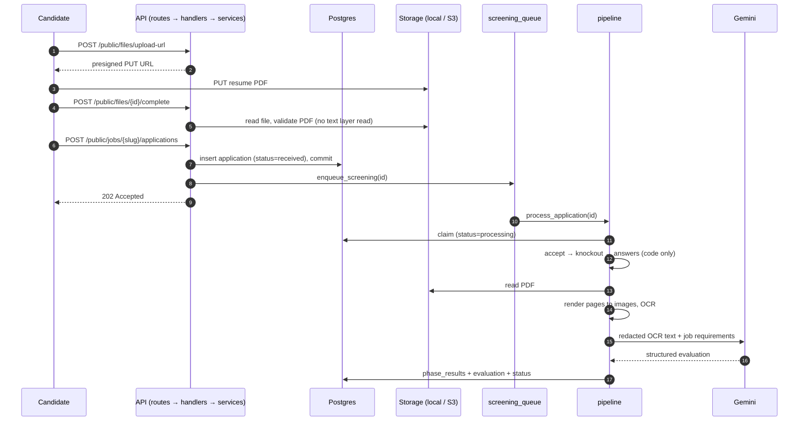
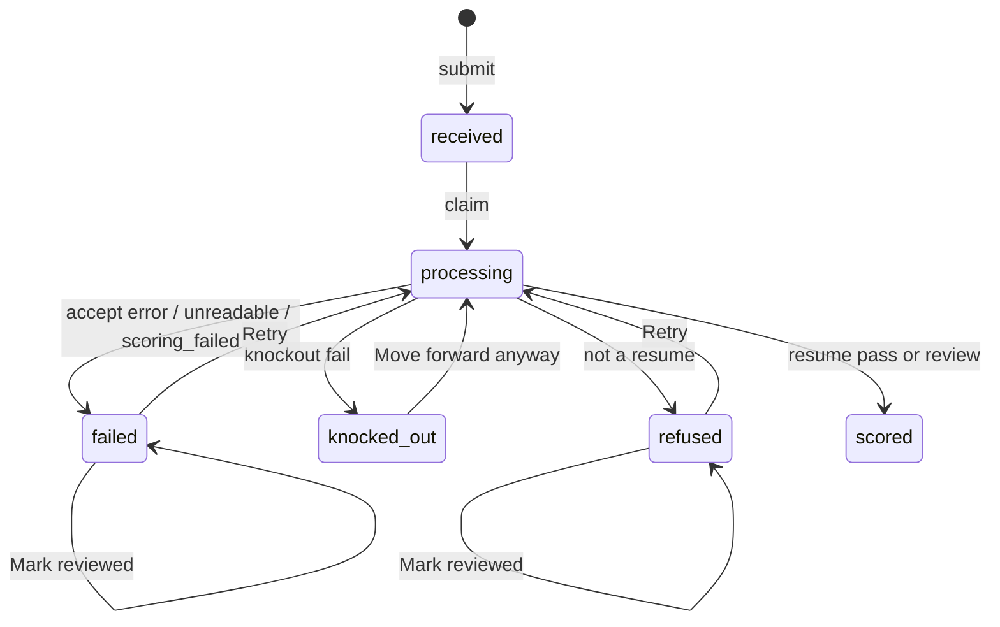

# Application evaluation flow

How an application moves from a candidate's upload to a score on the recruiter's leaderboard,
and what happens when it does not get there.

Code paths are relative to `top-match-backend/`. Defaults are from `app/core/config.py`.

## Overview

Submitting never waits on screening and never fails because of it (Rule 1). The `202` is
returned as soon as the application row is committed.

## Layers

| Layer | Folder | Responsibility |
|---|---|---|
| Routes | `app/api/v1/routes/` | Path, method, rate limits, dependencies. Calls one handler. No logic. |
| Handlers | `app/api/v1/handlers/` | Endpoint concerns: reading raw bodies and headers, local-storage-only checks, building file/CSV responses, mapping to response schemas. |
| Services | `app/services/` | Business rules, transactions, queueing. |
| Repositories | `app/repositories/` | All SQL. Repos `flush`; services `commit`. |
| Integrations | `app/integrations/` | Storage, PDF rasterizing, the Gemini client. |

## 1. Upload the resume

| Step | Endpoint | Service |
|---|---|---|
| Get an upload URL | `POST /public/files/upload-url` | `applications.request_upload_url` |
| Upload the file | `PUT` to the presigned URL (S3), or `PUT /public/files/{id}/content` (local storage only) | `applications.store_local_put` |
| Confirm | `POST /public/files/{id}/complete` | `applications.confirm_resume` |

On confirm the server checks:

- Content type is `application/pdf` and size ≤ `MAX_UPLOAD_BYTES` (5 MB).
- The file starts with `%PDF-`, opens with pypdfium2, is not encrypted, and has
  1–`MAX_RESUME_PAGES` (5) pages (`integrations/pdf.validate_pdf`).
- The PDF text layer is never read.

A file that fails any check is deleted and the request gets a `4xx`.

Custom-form file questions (portfolio, cover letter) use the same three steps under
`/public/jobs/{slug}/attachments/...` and `/public/attachments/...`. Attachments are stored
for the recruiter only and are never sent to the model.

## 2. Submit the application

`POST /public/jobs/{slug}/applications` → `services/applications.apply_to_job`

Body: `email`, `file_id`, `consented: true`, `answers` (keyed by form field id).

1. The job must exist (`404`) and be open (`409`).
2. The resume file must exist and not already be used on another application (`409`).
3. `services/forms.validate_answers` checks each answer against the job's form fields:
   required, type, option membership, text length, and number `min`/`max`. Errors return `422`
   with `field_errors`.
4. The email is normalized; one application per email per job (`409`).
5. The application is inserted with status `received` and committed, together with its
   attachments.
6. `screening_queue.enqueue_screening(application.id)` hands it to the pipeline.

Rate limits: 10/min per IP and 30/min per job on submit; 10/min per IP on uploads.

Knockout limits are separate from validation. A candidate whose answer is below a knockout
minimum can still submit; they are knocked out later and stay visible to the recruiter.

## 3. Queueing

`services/screening_queue.py` is the only place work is queued.

- `enqueue_screening(id, reclaim_processing=False)` starts `pipeline.process_application` as
  an asyncio task. It does nothing when `PIPELINE_ENABLED` is false (the test default).
- A task that crashes logs the application id and the exception type only, never its message.
- On shutdown, `drain()` waits up to 30 seconds for running tasks.

Work in progress is not durable yet. If the process stops mid-run, the stuck sweep recovers it
(section 6). Step 3 of `SCREENING_PLAN.md` replaces this module with a Postgres-backed queue.

## 4. The pipeline

`services/pipeline.process_application(application_id)`

### Claim

`applications_repo.claim_for_processing` atomically moves the row from `received` to
`processing` and stamps `processing_started_at`. When `reclaim_processing=True`, it also accepts
a row already in `processing`, which is how retries, overrides and the stuck sweep get in. If
the claim fails, another worker has the row and the run stops.

### Phases

Phases run in a fixed order. A run starts at the phase after `application.current_phase`, so
a retry or override continues where it left off instead of starting over.

| # | Phase | What it checks | Model? | Stops with |
|---|---|---|---|---|
| 1 | `accept` | Resume file still exists in storage | No | `failed` · `missing_file` |
| 2 | `knockout` | Recruiter knockout questions (`services/screening.evaluate_knockouts`) | No | `knocked_out` · `knockout_failed` |
| 3 | `answers` | Weighted score over scored questions (`services/screening.score_answers`) | No | never stops |
| 4 | `resume` | OCR, then model evaluation | Yes | `failed` · `unreadable` / `scoring_failed`, or `refused` · `not_resume` |

Each phase returns a `PhaseRun` (outcome, reasons, evidence, config version, optional final
status) and does not touch the database. `pipeline._record` is the only code that saves a run.
In one commit it:

- inserts a `phase_results` row,
- sets `current_phase`,
- on `fail`/`error`, sets `stopped_phase`, `stop_code` and `stop_reason`,
- sets the final status, or refreshes `processing_started_at` if the run continues,
- for the resume phase, saves `extracted_text` and replaces the `evaluations` row.

A phase with nothing to check (no knockout questions, no weighted questions) is recorded as
`skipped`.

### Knockout phase

Knockout rules live on the form field, next to the question:

| Field type | Rule | Fails when |
|---|---|---|
| `radio` / `dropdown` | `knockout.allowed_values` | The answer is not in the list |
| `number` | `knockout.min` / `knockout.max` | The answer is outside the limits, or missing |

A yes/no knockout is a `radio` field with `Yes`/`No` options; the builder adds it as a preset.
Knockout fields must be `required`. Every failing knockout is recorded, each with the
recruiter's reason. A knocked-out application never reaches OCR or the model.

`config_version` on the row is a hash of the job's form fields at the time of the run.

### Answers phase

Fields with `scoring` contribute to a 0–100 answers score:

- `radio` / `dropdown`: `option_scores[answer]` (0–1).
- `checkboxes`: the sum of the selected options' scores, capped at 1.
- `number`: `answer / target`, clamped to 0–1. With `direction: at_most` (expected salary),
  full points at or below the target and `target / answer` above it.

The score is `100 × Σ(weight × fraction) / Σ(weight)` and is stored in
`phase_results.evidence.answers_score`. It is shown on its own and is **not** combined with
the resume score. Free-text answers are stored and shown but not scored or sent to the model.

### Job conditions

Job conditions (work authorization, location, work mode, working hours, English level,
notice period, expected salary, credential, travel) are form fields tagged with `condition`
(`preset`, `importance`, candidate-facing `summary`, and `salary` range for expected salary).
They reuse the rules above; importance decides which one applies:

| Importance | Field carries | Effect |
|---|---|---|
| `must` | `knockout` | Knockout phase. Failing stops the run before OCR and the model. |
| `preferred` | `scoring` | Adds to the answers score. |
| `info` | neither | Shown to the recruiter only. |

English level and notice period use fixed, ordered options; a must condition passes one end
of the scale (`schemas/conditions.is_contiguous_from`). An expected salary passes at or below
the range maximum, including below the minimum. Conditions are never sent to the model.
`services/conditions.evaluate_condition` gives each answer a `pass`, `partial`, `fail` or
`not_scored` verdict for the detail page.

Questions, conditions and requirements text are checked against
`core/protected_characteristics.py` when a job is created or edited
(`services/guardrail`). A match returns 422 with `guardrail_errors`.

### Resume phase

Runs with no database session open, so OCR and the model call do not hold a connection.

1. **OCR** (`services/ingestion.extract_text`): each page is rendered to an image at `OCR_DPI`
   (150), capped at `OCR_MAX_PAGE_PIXELS`, and read with Tesseract. Only text visible on the
   rendered page reaches the model; the PDF text layer, metadata and hidden text never do
   (Rule 2).
2. **Redaction** (`services/redaction.redact_resume`): lines with personal details (date of
   birth, age, gender, marital status, religion, nationality, domicile, CNIC, father's name,
   S/O, D/O, photo captions) are replaced with `[removed]`. The model sees, and quotes are
   verified against, the redacted text. `extracted_text` keeps the original for the recruiter;
   `phase_results.evidence.redacted_lines` records only the count.
3. Under 40 characters of text → `failed` · `unreadable`. A PDF that cannot be rendered gets
   the same result.
4. **Model call** (`services/evaluation.evaluate` → `integrations/llm.GeminiEvaluationCompleter`):
   - At most `LLM_MAX_CONCURRENCY` (2) calls run at once per process.
   - Temperature 0, structured output parsed into `ModelEvaluation`.
   - Timeout `LLM_TIMEOUT_SECONDS` (60); up to `LLM_MAX_ATTEMPTS` (3) attempts with exponential
     backoff on timeouts, 5xx, and invalid output. Rate-limit (429) errors are not retried yet.
   - The resume is wrapped in `<<<RESUME>>>` / `<<<END RESUME>>>` and the prompt says to treat
     it as data. The prompt version is `app/prompts/evaluation.PROMPT_VERSION`.
   - Any failure after retries → `failed` · `scoring_failed`. The OCR text is kept.
5. **Checks on the model's answer** (`services/evaluation._from_completion`):
   - `is_resume = false` → `refused` · `not_resume`, with the model's refusal reason.
   - Each citation quote must appear in the redacted text (case- and whitespace-insensitive);
     unverified citations are dropped.
   - `injection_suspected` caps the score at 40.
   - `needs_review` is set when injection is suspected, there are no citations, none verify, or
     fewer than half verify. The phase outcome is then `review` instead of `pass`.
6. Status becomes `scored` and `applications.score` is set.

> The model currently produces the score itself. Step 2 of `SCREENING_PLAN.md` changes this so
> the server computes the score from per-requirement verdicts (Rule 6).

## 5. Application states

| Column | Meaning |
|---|---|
| `status` | `received`, `processing`, `scored`, `knocked_out`, `refused`, `failed` |
| `current_phase` | Furthest phase reached. A run resumes after it. |
| `stopped_phase` | Phase that stopped the run. Cleared on retry/override. |
| `stop_code` | `ReasonCode` value: `missing_file`, `knockout_failed`, `unreadable`, `not_resume`, `scoring_failed` |
| `stop_reason` | Text shown to the recruiter |
| `processing_started_at` | Last progress time, used by the stuck sweep |
| `reviewed_at` | Set by "Mark reviewed" |
| `score` | Resume score (scored applications only) |

`phase_results` keeps the full history. Rows are only ever inserted, never updated.

## 6. Recovery

`main._stuck_loop` runs `pipeline.recover_stuck_applications` every 60 seconds. It reprocesses:

- `received` rows created more than `STUCK_APPLICATION_MINUTES` (5) ago, and
- `processing` rows with no progress (`processing_started_at`) for 5 minutes.

Each is resumed with `reclaim_processing=True` from the phase after `current_phase`, so
finished phases are not repeated.

## 7. Recruiter actions

All are scoped to the recruiter's own jobs; anything else returns `404` (Rule 5). They live in
`services/applications.py`.

| Action | Endpoint | Allowed from | Effect |
|---|---|---|---|
| Retry | `POST /applications/{id}/rescore` | `failed`, `refused` | Restarts from the phase that stopped it; queues screening |
| Move forward anyway | `POST /applications/{id}/move-forward` | `knocked_out` | Records a `knockout` / `pass` row with the recruiter id and the original reason, then continues at `answers`; queues screening |
| Mark reviewed | `POST /applications/{id}/mark-reviewed` | `failed`, `refused` | Records a `review` row with the recruiter id and sets `reviewed_at`; status unchanged |

Overrides are stored in `phase_results.overridden_by_recruiter_id`.

## 8. What the recruiter sees

- **Leaderboard** `GET /jobs/{id}/leaderboard`. Sorted by score (highest first, unscored last),
  then by submit time. Filters: `status` (repeatable) and `stage` (`current_phase`). Counts
  always cover every status. The dashboard shows `received`, `processing` and `scored` by
  default, with separate lists below for knocked out, refused, unreadable and failed applicants,
  each with the reason and actions (Rule 3).
- **Detail** `GET /applications/{id}`. Score, strengths, gaps, verified citations, answers, the
  stage and stop reason, the answers score, the phase history, and a 15-minute resume download
  link.
- **CSV export** `POST /jobs/{id}/exports`. The first row is the screening disclaimer. Columns
  include `stopped at` and `reason`. Cells that could run as spreadsheet formulas are escaped.
  Each export is logged in `export_events`.
- **Public job page** `GET /public/jobs/{slug}`. Knockout rules and answer weights are removed,
  so candidates cannot see them.
- **Form warnings.** Job responses include `form_warnings` when a knockout looks like an age
  filter (date of birth, age, graduation year, or a cap on years of experience). Warnings never
  block saving.

## 9. Data handling

- Logs contain application ids only. Pipeline and queue failures log the exception type, not its
  message, and the database engine uses `hide_parameters=True` (Rule 4).
- Applications of jobs closed more than `RETENTION_DAYS` (30) ago are deleted with their files
  by `services/retention.purge_expired_applications`, which runs hourly. `phase_results` and
  `evaluations` are deleted with them.
- Outside `ENVIRONMENT=local`, the app refuses to start unless `GEMINI_DATA_USE_ACKNOWLEDGED`
  is set, so resume data only goes to a paid Gemini or Vertex AI tier.

## 10. Where to look

| Concern | File |
|---|---|
| Endpoints | `app/api/v1/routes/applications.py`, `app/api/v1/routes/jobs.py` |
| Submit, recruiter actions, leaderboard, detail | `app/services/applications.py` |
| Queueing | `app/services/screening_queue.py` |
| Phase runner and state changes | `app/services/pipeline.py` |
| Knockouts, answer scoring, age-proxy warnings | `app/services/screening.py` |
| OCR | `app/services/ingestion.py`, `app/integrations/pdf.py` |
| Model call | `app/integrations/llm.py`, `app/prompts/evaluation.py` |
| Citation checks, review flag | `app/services/evaluation.py` |
| Form field and knockout schemas | `app/schemas/forms.py` |
| Models and enums | `app/models/application.py`, `app/models/phase_result.py`, `app/models/enums.py` |
| Tests | `tests/api/test_screening_pipeline.py`, `tests/api/test_pipeline.py`, `tests/services/` |
