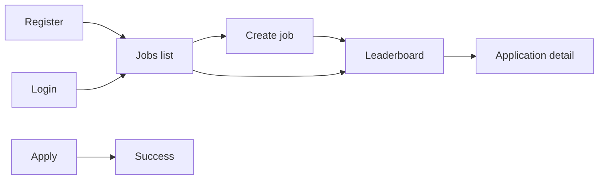

# Top Match Frontend — Master Plan

Stage-wise plan to turn the eight Stitch screens into a Next.js app on the existing API client.
Visual source: [`UI-Design`](UI-Design) (`code.html` + `screen.png` per screen, plus
[`UI-Design/calm_precision_middleware/DESIGN.md`](UI-Design/calm_precision_middleware/DESIGN.md)).
Do not copy those HTML files into `src/`. Recreate them as React + Tailwind.

Each stage ends with something runnable in the browser. Don't start the next stage until the
current stage's exit criteria pass.

Backend API is described in [`../PRD.md`](../PRD.md) and
[`../top-match-backend/master_plan.md`](../top-match-backend/master_plan.md). Frontend talks to
`NEXT_PUBLIC_API_URL` (default `http://127.0.0.1:8000/api/v1`).

## Status

| Stage | Name                         | Screens                                      | Status          |
| ----- | ---------------------------- | -------------------------------------------- | --------------- |
| 0     | Boilerplate & API client     | —                                            | ✅ Done         |
| 1     | Design system and shells     | shared layouts                               | ✅ Done         |
| 2     | Register and login           | 1, 2                                         | ✅ Done         |
| 3     | Jobs list                    | 3                                            | ✅ Done         |
| 4     | Create job                   | 4                                            | ✅ Done         |
| 5     | Leaderboard                  | 5                                            | ✅ Done         |
| 6     | Application detail           | 6                                            | ✅ Done         |
| 7     | Apply and success            | 7, 8                                         | ✅ Done         |
| 8     | End-to-end pass              | all                                          | ✅ Done         |
| 9     | Custom application forms     | 4, 5, 6, 7                                   | ✅ Done         |

## Already in place (Stage 0)

- Next.js App Router under `src/`, TypeScript, Tailwind v4, React Query, Axios.
- Types in [`src/types/`](src/types/) (`auth`, `jobs`, `applications`, `api`).
- Request functions in [`src/api/`](src/api/). Hooks in [`src/hooks/`](src/hooks/).
- Axios client with Bearer attach and single-flight refresh:
  [`src/lib/api.ts`](src/lib/api.ts).
- Login state: [`src/context/auth-context.tsx`](src/context/auth-context.tsx) (`useAuth()`:
  `user`, `isAuthenticated`, `isLoading`, `login`, `register`, `logout`).
- Tokens in `localStorage`. Failed refresh clears the session.

Do not add new fetch logic inside page components. Call the existing hooks.

## Working rules (every stage)

- App Router under `src/app`. Recruiter pages share a shell. `/apply` does not.
- Match layout, type, and status colors from DESIGN.md and the screen HTML. Tokens live in
  Tailwind v4 `@theme` (Inter + Material Symbols). Do not copy the CDN Tailwind config from each
  HTML file.
- Light theme only. Desktop-first recruiter UI. Apply and success must work on a phone.
- Show API errors with `getApiErrorMessage`. Another recruiter's job or application is a
  not-found state (never "forbidden").
- Backend `CORS_ORIGINS` must include the frontend origin (`http://localhost:3000` locally)
  before a browser call will succeed.
- Never log resume text, extracted text, or candidate emails.
- `npx tsc --noEmit` and `npx eslint src` stay green.

## Routes

| Route                                              | Who       | Screen folder                                      |
| -------------------------------------------------- | --------- | -------------------------------------------------- |
| `/`                                                | both      | redirect: signed-in → `/jobs`, else → `/login`     |
| `/register`                                        | public    | `screen_1_register`                                |
| `/login`                                           | public    | `screen_2_login`                                   |
| `/jobs`                                            | recruiter | `screen_3_jobs_list`                               |
| `/jobs/new`                                        | recruiter | `screen_4_create_job`                              |
| `/jobs/[jobId]`                                    | recruiter | `screen_5_job_dashboard_leaderboard`               |
| `/jobs/[jobId]/applications/[applicationId]`       | recruiter | `screen_6_application_detail`                      |
| `/apply/[slug]`                                    | candidate | `screen_7_candidate_apply`                         |
| `/apply/[slug]/done`                               | candidate | `screen_8_application_received`                    |

## Design details that are not API fields

Render these as static copy or omit them. Do not invent data.

- Omit nav items Candidates, Analytics, Settings, notifications, help, and the "Enterprise Tier"
  badge. Company name comes from `useAuth().user.company_name`.
- Password rule is the API rule: 8–128 characters. The register checkbox is required in the form
  and is **not** sent to the API.
- `GET /jobs` currently has no per-job counts and no average score. Stage 3 adds
  `application_counts` to that list response. Do not show a fake average score.
- Create-job "retention" radios and slug preview are display-only. Retention is the server default
  (30 days). The real apply URL is `public_url` after create.
- Apply location/type pills, REQ ids, and "careers" links are omitted. Notices come from
  `PublicJob`.
- Success screen shows the job title and the email just submitted (client state). No tracking
  reference; apply returns only `id` and `status`.
- Application detail shows strengths, gaps, citations, `needs_review`, and `injection_suspected`.
  It does not show citation ratios or model/token metadata. "Export this candidate" calls the
  existing export with that one id. The PDF opens via `toAbsoluteApiUrl(resume_url)` (iframe or
  new tab). The link expires in 15 minutes, so refetch the detail when it fails.

---

## Stage 1: Design system and shells

**Goal:** Tokens and layouts exist so later screens share one look.

### Work

- Put DESIGN.md colors, radii, and type into [`src/app/globals.css`](src/app/globals.css)
  (`@theme`). Load Inter and Material Symbols in [`src/app/layout.tsx`](src/app/layout.tsx).
- Shared components: button, input, badge (status colors), disclaimer banner.
- Auth layout: centered card (register/login).
- Recruiter shell: top bar with logo, company name, Jobs, logout.
- `/` sends a signed-in recruiter to `/jobs` and everyone else to `/login`.
- Recruiter routes wait on `useAuth().isLoading`, then redirect to `/login` when signed out.

### Exit criteria

- Tokens match DESIGN.md (light theme).
- Signed-out visit to `/jobs` ends on `/login`.
- Signed-in visit to `/` ends on `/jobs` (once `/jobs` exists; until then a placeholder is fine).

---

## Stage 2: Register and login

**Goal:** A recruiter can create an account and sign in.

Screens: [`UI-Design/screen_1_register/code.html`](UI-Design/screen_1_register/code.html),
[`UI-Design/screen_2_login/code.html`](UI-Design/screen_2_login/code.html).

### Work

- `/register`: company name, email, password (show/hide), required policy checkbox (UI only).
  Submit via `useAuth().register` → `/jobs`.
- `/login`: email, password. Submit via `useAuth().login` → `/jobs`.
- Inline field errors. Login failure is one message: invalid email or password. No
  forgot-password link.

### API

| Action   | Hook / context        | Endpoint                 |
| -------- | --------------------- | ------------------------ |
| Register | `useAuth().register`  | `POST /auth/register`    |
| Login    | `useAuth().login`     | `POST /auth/login`       |
| Session  | `GET /auth/me`        | already in AuthProvider  |

### Exit criteria

- Register with a new email lands on `/jobs` (or Stage 1 placeholder) and persists after refresh.
- Duplicate email shows the API 409 message.
- Wrong password shows a generic invalid-credentials message.
- Logged-in user hitting `/login` is sent to `/jobs`.

---

## Stage 3: Jobs list

**Goal:** Home after login. See every job this company owns.

Screen: [`UI-Design/screen_3_jobs_list/code.html`](UI-Design/screen_3_jobs_list/code.html).
Route: `/jobs`.

### Work

- `useJobs()`. Cards: title, open/closed badge, `public_url` with copy, created date, status
  counts (received / processing / scored / refused / failed).
- Client-side search and open/closed filter. Empty state links to `/jobs/new`.
- Header metrics: open-job count is a client sum of `status === "open"`. Sum the five status
  chips across jobs if counts exist. **Skip average match score.**

### Backend change

`GET /jobs` must include `application_counts` on each job (the count query already exists for
job detail). Update the list response schema and frontend `Job` type to match.

### API

| Action    | Hook      | Endpoint       |
| --------- | --------- | -------------- |
| List jobs | `useJobs` | `GET /jobs`    |

### Exit criteria

- Recruiter sees only their jobs. Copy link writes `public_url` to the clipboard.
- Closed jobs are visually muted and still listed.
- Empty list shows a create CTA.
- Status chips match the database after applications exist.

---

## Stage 4: Create job

**Goal:** Recruiter pastes the role and gets a public apply link.

Screen: [`UI-Design/screen_4_create_job/code.html`](UI-Design/screen_4_create_job/code.html).
Route: `/jobs/new`.

### Work

- Fields: title, description, requirements (all required). Helper: the AI scores only against
  requirements.
- Slug preview and retention radios are display-only (30-day copy). Do not POST them.
- `useCreateJob()`, then navigate to `/jobs/{id}` so the new `public_url` can be copied.
- Cancel returns to `/jobs`.

### API

| Action     | Hook           | Endpoint        |
| ---------- | -------------- | --------------- |
| Create job | `useCreateJob` | `POST /jobs`    |

### Exit criteria

- Blank fields stay on the form with validation.
- Success opens the new job dashboard with a real `public_url`.

---

## Stage 5: Leaderboard

**Goal:** Real-time screening dashboard. This is the main recruiter screen.

Screen: [`UI-Design/screen_5_job_dashboard_leaderboard/code.html`](UI-Design/screen_5_job_dashboard_leaderboard/code.html).
Route: `/jobs/[jobId]`.

### Work

- `useJob` + `useLeaderboard` (already polls every 3s). Disclaimer banner from
  `screening_disclaimer`. Copy apply link. Status chips from `counts` (always all five).
- Status filter, score order (nulls last), pagination via `limit` / `offset`.
- Edit slide-over: `useUpdateJob`. Close confirm: `useCloseJob`.
- Export: either `top_n` or selected `application_ids`, never both. `useExportJob`, then download
  the CSV (first row is the disclaimer).
- Row click → application detail. `failed` row: `useRescoreApplication`. Empty state: share the
  apply link.
- Unknown / other recruiter's `jobId` → not found.

### API

| Action      | Hook                      | Endpoint                          |
| ----------- | ------------------------- | --------------------------------- |
| Job header  | `useJob`                  | `GET /jobs/{id}`                  |
| Leaderboard | `useLeaderboard`          | `GET /jobs/{id}/leaderboard`      |
| Edit        | `useUpdateJob`            | `PATCH /jobs/{id}`                |
| Close       | `useCloseJob`             | `POST /jobs/{id}/close`           |
| Export      | `useExportJob`            | `POST /jobs/{id}/exports`         |
| Rescore     | `useRescoreApplication`   | `POST /applications/{id}/rescore` |

### Exit criteria

- New applications move received → processing → scored (or refused / failed) without a full
  page reload.
- Export downloads a CSV. Closed job stops new applies on the public page.
- Filter and pagination stay in sync with the query params sent to the API.

---

## Stage 6: Application detail

**Goal:** Explain the AI score with evidence.

Screen: [`UI-Design/screen_6_application_detail/code.html`](UI-Design/screen_6_application_detail/code.html).
Route: `/jobs/[jobId]/applications/[applicationId]`.

### Work

- `useApplication`. Score, status, email, applied at, strengths, gaps, citation quotes,
  `needs_review` and `injection_suspected` badges, disclaimer.
- Refused: `refusal_reason`, no score. Failed: Rescore button.
- Open PDF: `toAbsoluteApiUrl(resume_url)` (iframe or new tab). If the 15-minute token is
  expired, refetch the detail and retry.
- Export this one application via `POST /jobs/{jobId}/exports` with `application_ids: [id]`.
- Back to the leaderboard. Missing / foreign application → not found.

### API

| Action   | Hook            | Endpoint                         |
| -------- | --------------- | -------------------------------- |
| Detail   | `useApplication`| `GET /applications/{id}`         |
| PDF      | resume URL      | `GET /public/resumes/{token}`    |
| Rescore  | as Stage 5      | `POST /applications/{id}/rescore`|
| Export   | `useExportJob`  | `POST /jobs/{id}/exports`        |

### Exit criteria

- Citations render as claim + quote. PDF opens for a scored application.
- Failed application can be queued again. Refused application has no score.

---

## Stage 7: Apply and success

**Goal:** Candidate applies with email + PDF + consent. No account.

Screens: [`UI-Design/screen_7_candidate_apply/code.html`](UI-Design/screen_7_candidate_apply/code.html),
[`UI-Design/screen_8_application_received/code.html`](UI-Design/screen_8_application_received/code.html).

### Work

- `/apply/[slug]`: `usePublicJob`. Title, description, requirements, `privacy_notice`,
  `ai_screening_notice`, consent checkbox.
- Closed job hides the form ("no longer accepting applications").
- Upload PDF with `useUploadResume` (`Content-Type: application/pdf`), then `useApply` with
  `{ email, file_id, consented: true }`. Show limits: PDF, 5 MB, 5 pages.
- Errors stay on the form: invalid file, duplicate email, missing consent, unknown slug,
  429 rate limit.
- On 202, navigate to `/apply/[slug]/done` with job title and email in client state (query or
  session). No score. No "apply again" CTA.

### API

| Action     | Hook             | Endpoint                                      |
| ---------- | ---------------- | --------------------------------------------- |
| Public job | `usePublicJob`   | `GET /public/jobs/{slug}`                     |
| Upload     | `useUploadResume`| `POST /public/files/upload-url` then PUT, then `POST /public/files/{id}/complete` |
| Apply      | `useApply`       | `POST /public/jobs/{slug}/applications`       |

### Exit criteria

- Happy path: upload → apply → success. Duplicate email is 409 on the form.
- Closed job cannot submit. Unknown slug is not found.
- Candidate never sees other applicants or scores.

---

## Stage 8: End-to-end pass

**Goal:** The recruiter and candidate happy paths work against a running backend.

### Work

Walk every route in the browser:

1. Register, refresh, still signed in.
2. Login, logout, signed-out `/jobs` → `/login`.
3. Create job, copy `public_url`.
4. Apply (second browser / incognito), then see the row on the leaderboard after poll.
5. Open detail, PDF, export CSV, rescore a failed row if one exists.
6. Close the job; apply again is rejected.
7. Another recruiter's job id is not found.

Mark Stages 1–8 done in this file when they pass.

### Exit criteria

- The list above works against local API + `CORS_ORIGINS` including the frontend origin.
- `tsc` and `eslint` are green.

---

## Stage 9: Custom application forms

**Goal:** Recruiters build extra questions on create/edit job. Candidates fill them on apply.
Recruiters read answers on application detail. AI scoring is unchanged.

### Work

- `FormBuilder` on Create Job and an Application Form dashboard panel (locked after the first
  application). Email, resume, and consent are shown as always-included rows.
- Public apply renders `form_fields` between resume and consent. Resume and attachments upload in
  parallel, then apply sends `answers`. Server `field_errors` map onto fields.
- Application detail shows an Application answers card. File downloads use native `fetch` (a 401
  must not refresh the recruiter token).

### API

| Action            | Hook / UI                         | Endpoint |
| ----------------- | --------------------------------- | -------- |
| Create/update form | `useCreateJob` / `useUpdateJob` | `POST /jobs`, `PATCH /jobs/{id}` (`form_fields`) |
| Public form       | `usePublicJob`                    | `GET /public/jobs/{slug}` (`form_fields`) |
| Attachment upload | `useUploadAttachment`             | `POST /public/jobs/{slug}/attachments/upload-url` then PUT, then complete |
| Apply answers     | `useApply`                        | `POST /public/jobs/{slug}/applications` (`answers`) |
| Read answers      | `useApplication`                  | `GET /applications/{id}` (`answers`) |
| Download file     | native `fetch`                    | `GET /public/attachments/{token}` |

### Exit criteria

- A job with no custom fields still applies with email + resume + consent.
- Required custom fields block submit. Optional fields can be skipped.
- After the first application, the form panel is read-only.
- Recruiter detail shows answers and can download file-field uploads.

---

## Deferred

- Google OAuth, forgot password, candidate accounts.
- Candidates / Analytics / Settings nav, notifications, billing, team members.
- Per-job average score, markdown job descriptions, in-app PDF page controls.
- Dark theme, mobile-first recruiter dashboard.
- Durable queue / S3 (backend Stage 7 leftovers).
